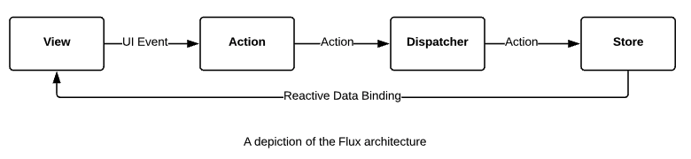
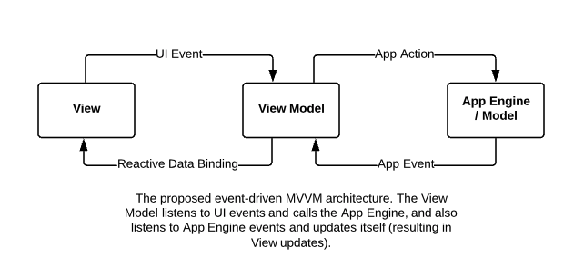

**Abstract.** Flux/Redux, while being one of the most widely used architectures 
front-end applications using the React UI component library, has 
demonstrated only limited success in battling the traditional 
complexities involved in front-end application development. Here we 
briefly look at some of the reasons and propose an event-driven MVVM 
(model-view-view-model) architecture.

# 1. Problems with Flux/Redux

For  the purpose of this paper, we will choose the most widely used variant  of the Flux [1] architecture: Redux [2]. While Redux makes specific UI  workflows easier to reason about, as the application grows larger, Redux  code bases become increasingly difficult to manage. Modularization  helps to an extent, but only when there are only limited  interactions between different parts of the application. The more  interactions there are between different parts of the application, the  more difficult it becomes to trace execution through code: an action  will need to trigger multiple reducers and effects. Furthermore, in  Redux, code is not organized by the workflow they implement, but by concern: actions, reducers, effects etc., are placed in separate files. 

 

# 2. Principles and assumptions  

The  proposed architecture is based on the following principles and  assumptions. It is our experience that these principles and assumptions  apply primarily to large, complex front-end applications that need to be  maintained over a long period of time by a relatively large number of  developers. The reader’s experience may vary. 

1. The primary problem present-day front-end architectures attempt to solve is code comprehensibility. 

1. While  back end systems have successfully employed layered architecture  (addressing vertical complexity) and modularization (addressing  horizontal complexity) to reduce code complexity, the same architectural  solutions have had limited success in addressing the code complexity of  front-end applications. 

1. Front-ends  applications are event-driven systems with real-time constraints  running on non-scalable infrastructure (a user’s machine), within a  single runtime environment (the browser),  which contributes to the difficulties of successfully applying  traditional back-end architecture solutions to front-ends.  

1. The  best way to address complexity is not through the introduction of  patterns, through scoping code, i.e. by ensuring that code implementing a  given feature is localized (to a function, a file or module) and do not  interact with other parts of the code except through well-defined API  calls. 

1. Organizing  code based on separation of concerns (e.g. actions, stores, reducers)  rather than data and events (e.g. users, orders) reduces  comprehensibility as the application grows more complex. 

1. Complexity  of an application grows linearly with the number of events, and  geometrically with the interactions between different events. 

1. Data flow between different layers of the application should always take place via well-defined APIs. 

1. Reactive  data binding (which is an implicit data flow mechanism between a view  and its data) should be limited to the view-model (VM) layer only. 

1. In  a non-blocking environment (such as a single-threaded front-end), only  those API functions that read the local state of a module should return  values. API functions that modify the module state or reach out to data  sources outside the module, should not return values, but instead employ  events to return values to the caller. 

1. Business logic must be strictly encapsulated away from the front-end code. 

 

# 3. Event-emitting models  



The  primary difference between the popular Flux/Redux architecture and the  proposed architecture is the replacement of the “store” with a model that encapsulates both the business state and business logic. This may  alternatively be termed an “application engine”, and thought of in this  manner: 

*Engine = Model + Controller – View* 

This  model (or “engine”) encapsulates all business data and logic and is  completely devoid of presentational concerns, in that it can be  integrated into any type of application that requires the business logic  concerned: GUIs, CLIs, batch processes etc. 

Based  on the principles outlined in the previous section, the model will  expose a well-defined API to the outside world: a set of getter  functions that immediately return local state within the model, a set of  functions that set off operations within the model but do not return  anything, and a set of events that are emitted at the end of operations,  which the callers of the API must subscribe to. 



Here is a partial  source code listing of a hypothetical to-do application engine: 

``` javascript
class TodoEngine { 
  addEventListener(listener) { 
    this.listeners.push(listener); 
  } 

  createTodo(summary) { 
    let todo = new Todo(summary); 
    this.todos.push(todo); 
    this.emit(CREATE_TODO, todo);  
  } 

 
  findTodoById(id) { 
    return this.todos.find({id: id}); 
  } 

  completeTodo(id) { 
    let todo = this.findTodoById(id); 
    if (!todo) { 
      this.emit(COMPLETE_TODO, {error: 'No entry by that id'}); 
      return; 
    } 

    todo.status = COMPLETED; 
    this.emit(COMPLETE_TODO, todo); 
  } 
} 

```


# 4. Event-listening view models 

Here the view does not react to a central store, but to its own view model only. The view model in turn listens to events emitted by the model/engine and updates its own state. Here we have used the state of a root level container component written using React as an example:

``` javascript
class TodoView extends React.Component { 
  constructor() { 
    this.engine = new TodoEngine(); 
  } 

  onViewMount() { 
    this.engine.addEventListener(this.onTodoEngineEvent); 
  } 

  onViewUnmount() { 
    this.engine.removeEventListener(this.onTodoEngineEvent); 
  } 

  onTodoEngineEvent(e) { 
    switch (e.type) { 
      case CREATE_TODO: 
        if (e.error) { 
          this.showMessage('Failed to create todo: ' + e.message); 
          return; 
        } 

        this.updateTodoView(this.engine.getTodos()); 
      break; 
    } 
  } 
} 

```

 

# 5. Production usage  

This  architecture has been used in four production applications, including  two applications that have been in production for close to two years. Three of the four applications perform business critical functions. In  each application, the view layer was built with React, while the view  model layer was the state of a root level “container component” [4]. 

While  the view and the view-model layers (which are where the traditional  front-end code complexity resides) have scaled well as the applications  grew in size, the model/engine often became unmanageably heavy. The  solution to this problem was relatively trivial, and could be  implemented with no effect on the view layer: the internal  implementation of the engine was split into smaller mini-engines, each  handling specific functional areas (such as users, orders), while  keeping the public API interface of the engine unchanged. 

 

# References 

1. Flux architecture https://facebook.github.io/flux/docs/in-depth-overview  

1. Redux architecture https://github.com/reduxjs/redux  

1. You might not need redux https://medium.com/@dan_abramov/you-might-not-need-redux-be46360cf367  

1. Presentational and container components https://medium.com/@dan_abramov/smart-and-dumb-components-7ca2f9a7c7d0  